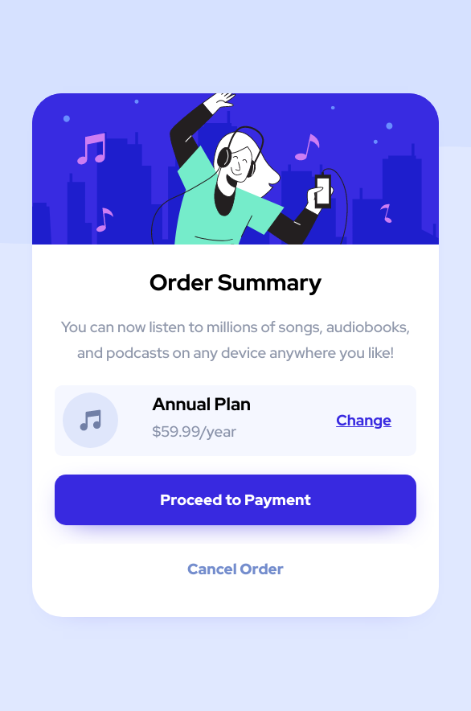
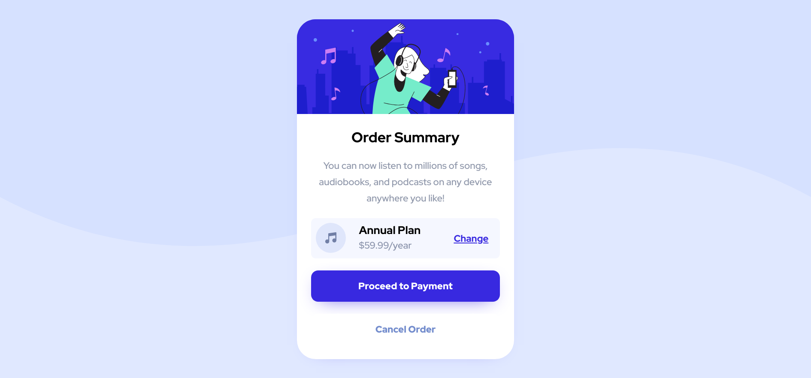

# Frontend Mentor - Order summary card solution

## Table of contents

-   [Overview](#overview)
    -   [The challenge](#the-challenge)
    -   [Screenshot](#screenshot)
    -   [Links](#links)
-   [My process](#my-process)
    -   [Built with](#built-with)
    -   [What I learned](#what-i-learned)
-   [Author](#author)

## Overview

### The challenge

Users should be able to:

-   See hover states for interactive elements

### Screenshot

#### Mobile



#### Desktop



### Links

-   Solution URL: [FrontEndMentor](https://www.frontendmentor.io/solutions/responsive-sass-pug-and-webpack-Yp5a0weQ3)
-   Live Site URL: [LiveSite](https://dazzling-torvalds-2f718a.netlify.app/)

## My process

### Built with

-   Pug
-   Sass
-   Grid
-   Flexbox
-   Mobile-first workflow
-   Webpack

### What I learned

This project help me practice webpack, pug

I also write module html (pug) and module css (sass)

JavaScript just for development (webpack-dev-server)

I done the challenge (hover state) base on background lightness, so I don't need to write hover for each button components

```scss
@if (lightness($backgroundColor) <= 70%) {
	&:hover {
		background-color: lighten($backgroundColor, 15%);
	}
} @else {
	&:hover {
		color: darken($text, 15%);
	}
}
```

## Author

-   Facebook: [PhamBaoTin]()
-   Frontend Mentor - [Tin.Pham](https://www.frontendmentor.io/profile/tin-pham)
-   Discord - ShinTakara#7068
